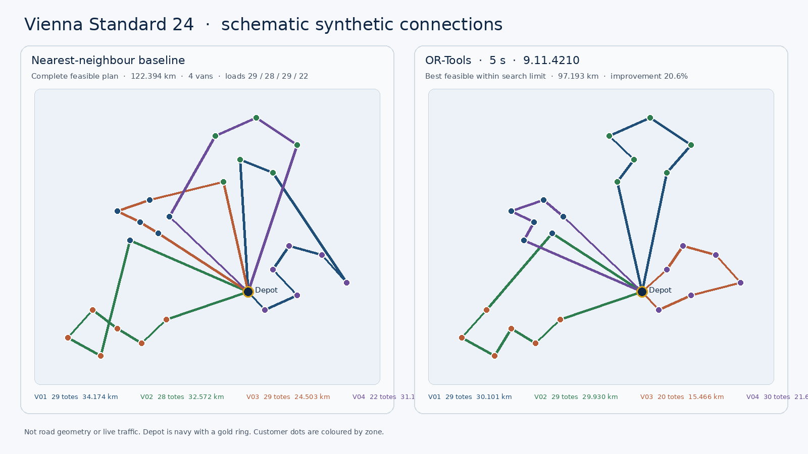
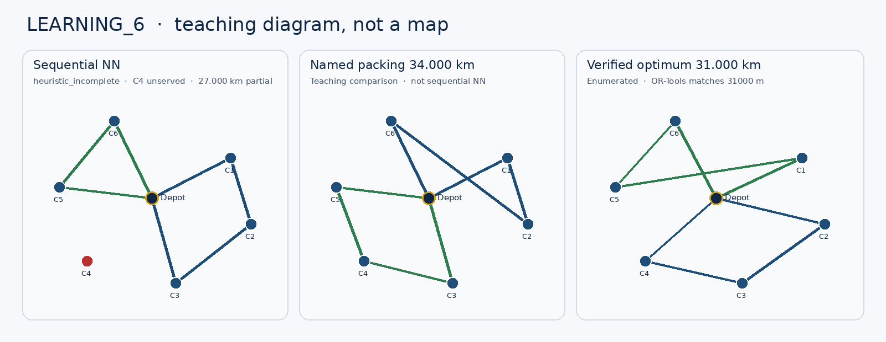
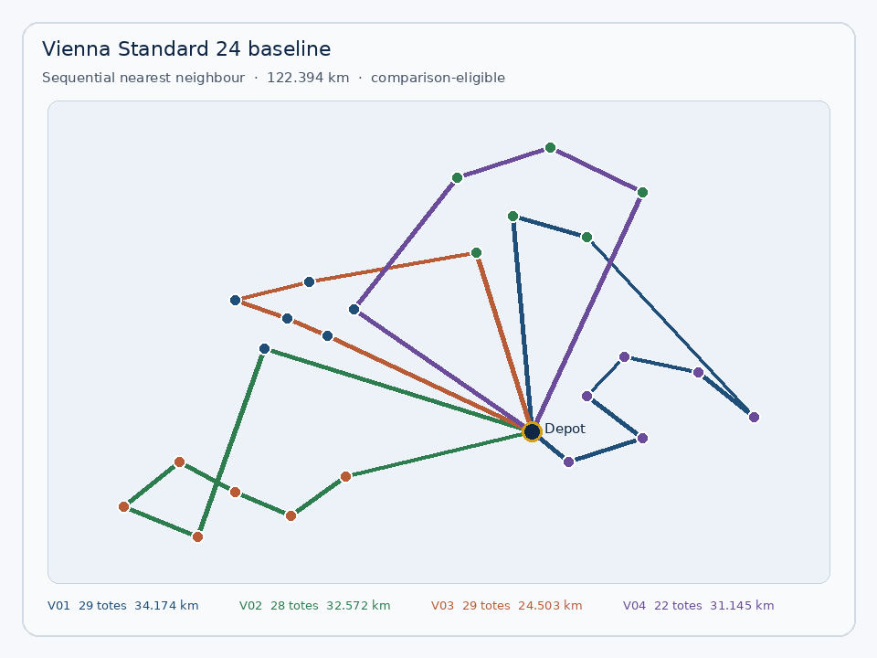
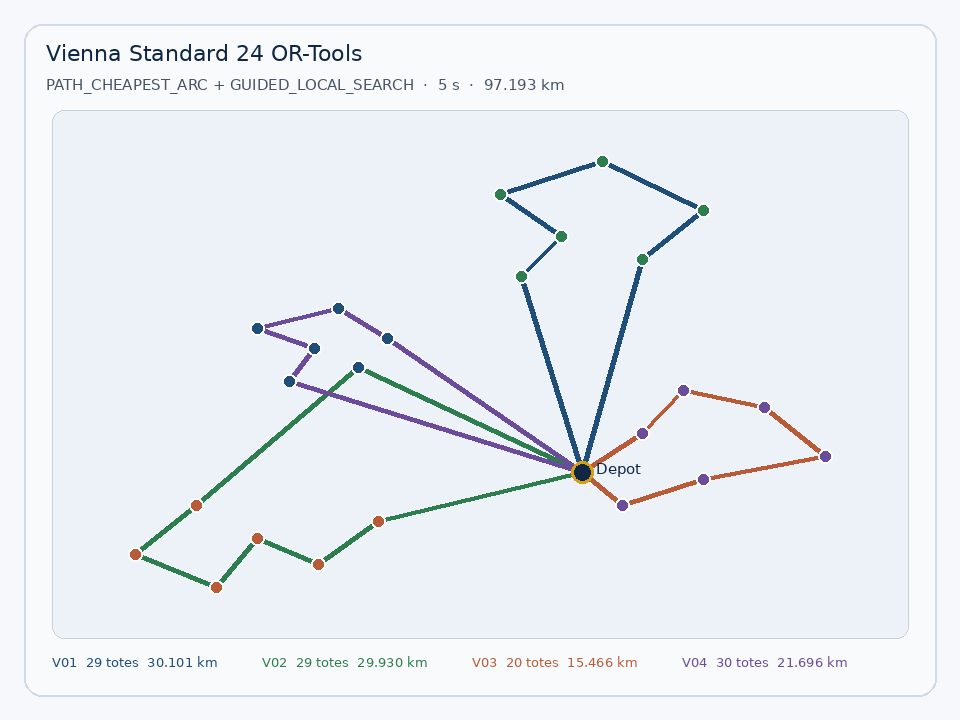
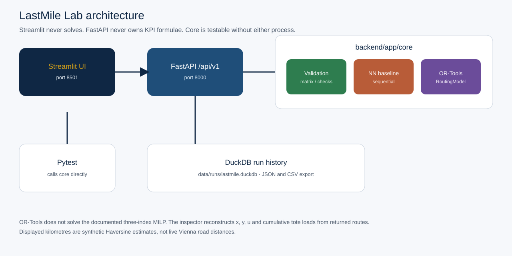

# LastMile Lab: ViennaCart CVRP Dispatch Planner

Inspectable static morning dispatch: assign every unsplit tote order to one homogeneous van, sequence the stops, and show how much a capacity-aware nearest-neighbour plan improves under Google OR-Tools — with the model, the matrix, and the KPIs all reconcilable.

> LastMile Lab is a fictional portfolio case study. ViennaCart is a fictional operator. All depots, customers, order demands, routes, distances, and operating assumptions are synthetic. The application does not use proprietary customer data or live Vienna traffic information.



*Vienna Standard 24 at publish time (4 September 2026). Left: complete sequential nearest-neighbour baseline, 122.394 km. Right: OR-Tools 9.11.4210 with a 5-second limit, 97.193 km (20.6% shorter). Route lines are schematic synthetic connections, not road geometry or live traffic.*

## Live demo

The planner is live at **[https://lastmilelab.streamlit.app/](https://lastmilelab.streamlit.app/)**. Streamlit Community Cloud serves the UI; a Render FastAPI service runs planning. Hosting notes: [`docs/deployment.md`](docs/deployment.md).

| Surface | URL |
|---|---|
| Streamlit planner | https://lastmilelab.streamlit.app/ |
| GitHub (source) | https://github.com/syeddanishali17/LastMileLab2 |

Local two-process development:

| Surface | Local URL |
|---|---|
| Streamlit planner | http://localhost:8501 |
| API health | http://127.0.0.1:8000/health |
| OpenAPI `/docs` | http://127.0.0.1:8000/docs |

Docker Compose publishes only Streamlit (`http://localhost:8501` by default). Check API health from the backend container:

```bash
docker compose exec backend python -c "import urllib.request; print(urllib.request.urlopen('http://127.0.0.1:8000/health').read().decode())"
```

Expected body includes `"status":"ok"`. See [`docs/deployment.md`](docs/deployment.md).

### Application journey

**Overview → Scenarios → Plan.** Overview explains the delivery problem and distinguishes the published Vienna example from a live run. Scenarios offers three presets — Standard 24, Tight Capacity 24, and Wide Geography 24 — plus a custom tote-demand editor with live capacity checks. **Run comparison** executes the nearest-neighbour baseline and OR-Tools search, then opens **Plan** (heading: **Route comparison**) with both maps, API result metrics, route tables, and JSON/CSV ZIP downloads.

**Methodology** and **Solution verification** are secondary pages. The six-customer teaching example stays in the documentation and regression tests, outside the normal application journey. The sidebar uses Streamlit's default auto state and holds navigation plus the English/Deutsch control. Start the UI with `streamlit run frontend/Home.py`. [UX research and file map](docs/ux_rewrite.md).

## Contents

1. [Business problem](#business-problem)
2. [MVP assumptions](#mvp-assumptions)
3. [Demand and capacity](#demand-and-capacity)
4. [Vienna Standard 24 demo](#vienna-standard-24-demo)
5. [LEARNING_6](#learning_6)
6. [Application screenshots](#application-screenshots)
7. [Architecture](#architecture)
8. [Mathematical formulation](#mathematical-formulation)
9. [Methodology and synthetic data](#methodology-and-synthetic-data)
10. [Technology stack](#technology-stack)
11. [Local setup](#local-setup)
12. [Tests](#tests)
13. [API](#api)
14. [Limitations](#limitations)
15. [Roadmap](#roadmap)
16. [Licence](#licence)

---

## Business problem

ViennaCart is a fictional same-day e-commerce operator with one urban depot. At the start of the morning wave the planner knows every order, every customer location, every tote demand, and the available homogeneous vans. Each van loads once, runs one route, and returns to the same depot.

The application answers:

> How should ViennaCart assign mandatory customer orders to its available vans and sequence the deliveries so that every order is served without exceeding van capacity, while minimising total distance travelled?

It is decision support for one frozen planning period. It is not live traffic control.

## MVP assumptions

| Decision | Rule |
|---|---|
| Depot | One depot |
| Fleet | Identical vans; a van may remain unused |
| Demand | Integer delivery totes; one customer, one van, full order |
| Service | Every customer must appear exactly once |
| Split deliveries | Not allowed |
| Trips | One route per vehicle; start and end at the depot |
| Distance | Symmetric integer-metre matrix; display km to 3 decimals |
| Objective | Minimise total route distance, including depot return legs |
| Planning | Static, deterministic, one period |
| Solver | Google OR-Tools `RoutingModel` |

If one order exceeds van capacity, or total demand exceeds fleet capacity, the scenario is `infeasible` and the solver is not run. If those checks pass but search returns no complete plan, the status is `no_solution_found` — not a proof of infeasibility. The optimiser never silently drops a customer.

Out of scope for this release: time windows, live traffic, split deliveries, multi-trips, multiple depots, heterogeneous vehicles, optional customers, authentication, and Mapbox. Full list: [`docs/limitations.md`](docs/limitations.md).

## Demand and capacity

A tote is one reusable order container. Demand and capacity share that integer unit so packing is auditable without converting litres or kilograms.

Vienna Standard 24:

| Quantity | Value |
|---|---:|
| Customers | 24 |
| Total demand | 108 totes |
| Fleet | 4 vans × 30 totes |
| Fleet capacity | 120 totes |
| Spare capacity | 12 totes |
| Zone Z1 demand | 35 totes |
| Zone Z2 demand | 29 totes |
| Zone Z3 demand | 24 totes |
| Zone Z4 demand | 20 totes |

Z1 (35 totes) does not fit on one 30-tote van. The planner cannot assign one van per geographic zone; at least one Z1 customer must ride with another route. That is the intended CVRP challenge.

The Scenarios page also offers two further curated presets with the same 108-tote demand: **Tight Capacity 24** (4 vans × 28 totes, 4 totes spare) and **Wide Geography 24** (same fleet as Standard, stops spread farther across Vienna). LEARNING_6 remains a six-customer teaching fixture in tests and docs (20 totes, 2 vans × 10); it is not in the primary UI selector.

## Vienna Standard 24 demo

Computed on 4 September 2026 from `plan_baseline("VIENNA_STANDARD_24")` and `plan_optimise("VIENNA_STANDARD_24", time_limit_seconds=5)`.

| Item | Value |
|---|---|
| OR-Tools | `ortools==9.11.4210` |
| First solution | `PATH_CHEAPEST_ARC` |
| Local search | `GUIDED_LOCAL_SEARCH` |
| Time limit | **5 seconds** |
| Baseline status | `feasible`, `comparison_eligible` |
| Optimised status | `feasible`, `solver_termination=success` |
| Customers served | 24 / 24 on both plans |
| Vehicles used | 4 / 4 |

| KPI | Baseline (sequential NN) | OR-Tools (5 s) |
|---|---:|---:|
| Total distance | **122.394 km** (122394 m) | **97.193 km** (97193 m) |
| Distance improvement | — | **20.6%** |
| Used-fleet utilisation | 90.0% | 90.0% |
| Van loads (totes) | 29 / 28 / 29 / 22 | 29 / 29 / 20 / 30 |

Improvement is `100 × (122394 − 97193) / 122394 = 20.590…%`, displayed to one decimal as in the UI.

The OR-Tools plan is the **best feasible solution found within the configured search limit**. It is not a globally optimal claim. Guided local search is not bit-deterministic; a later run on another machine may differ slightly. The nearest-neighbour kilometres and sequences are deterministic and covered by tests. Raw publish-time payload: [`docs/screenshots/vienna_standard_24_publish.json`](docs/screenshots/vienna_standard_24_publish.json).

### Baseline routes (deterministic)

| Van | Load | Distance | Sequence |
|---|---:|---:|---|
| V01 | 29 | 34.174 km | Depot → C022 → C020 → C019 → C024 → C021 → C023 → C009 → C007 → Depot |
| V02 | 28 | 32.572 km | Depot → C017 → C014 → C013 → C015 → C018 → C016 → C005 → Depot |
| V03 | 29 | 24.503 km | Depot → C003 → C001 → C002 → C004 → C012 → Depot |
| V04 | 22 | 31.145 km | Depot → C006 → C008 → C010 → C011 → Depot |

### OR-Tools routes (publish-time snapshot, 5 s)

| Van | Load | Distance | Sequence |
|---|---:|---:|---|
| V01 | 29 | 30.101 km | Depot → C009 → C011 → C010 → C008 → C007 → C012 → Depot |
| V02 | 29 | 29.930 km | Depot → C017 → C014 → C013 → C016 → C018 → C015 → C003 → Depot |
| V03 | 20 | 15.466 km | Depot → C022 → C020 → C023 → C021 → C024 → C019 → Depot |
| V04 | 30 | 21.696 km | Depot → C005 → C001 → C002 → C004 → C006 → Depot |

V04 is loaded to capacity (30/30). That is reconstructed tote demand, not an MTZ potential.

## LEARNING_6

Do **not** read sequential nearest neighbour as a complete 34 km baseline.

| Plan | Status | Distance | What it is |
|---|---|---|---|
| Sequential NN | `heuristic_incomplete`, C4 unserved | **27.000 km partial** (`partial_distance_metres=27000`). Objective is null. Not comparison-eligible. | Required greedy construction. Tie-break from the depot picks C1 over C6. V01 then takes C2 and C3 and cannot take C4. |
| Named packing | Teaching reference only | **34.000 km** | `{C1,C2,C6}` and `{C5,C4,C3}`. Not sequential NN. |
| Verified optimum | `feasible` | **31.000 km** (31000 m) | Independent enumeration of the two feasible 3-and-3 partitions, matched by OR-Tools. |

Stored depot id: `DEPOT_L6`. Display label: `Depot`.

Walkthrough: [`docs/learning_6_sequential_nn.md`](docs/learning_6_sequential_nn.md). Enumeration: [`docs/learning_6_enumeration.md`](docs/learning_6_enumeration.md).



*Node positions are a teaching layout. Distances come from the backend matrix, not from this drawing.*

## Application screenshots



*Dispatch-style schematic of the complete baseline. Same numbers as the demo table. Not map tiles; the live UI draws these connections on CARTO Positron and captions them as synthetic.*



*Publish-time OR-Tools plan. Compact clusters versus the crossing NN rays. Still labelled feasible, not optimal.*



*Streamlit never solves. FastAPI never owns KPI formulae. Pytest calls `backend/app/core` directly.*

The live Streamlit pages (Overview, Scenarios, Plan, plus optional Methodology and Solution verification) are the interactive screenshots. Capture those from [the running demo](https://lastmilelab.streamlit.app/) if a walkthrough needs browser chrome.

Regenerate schematic figures from the cloned repository root (`pillow` is in `backend/requirements-dev.txt`):

```bash
python -m pip install -r backend/requirements.txt -r backend/requirements-dev.txt
python scripts/generate_portfolio_figures.py
```

## Architecture

```text
Browser → Streamlit (published :8501) → FastAPI /api/v1 (internal :8000)
                              ├─ validation, Haversine matrix
                              ├─ sequential nearest neighbour
                              ├─ OR-Tools RoutingModel
                              ├─ KPIs and solution invariants
                              └─ DuckDB run history + JSON/CSV export
```

OR-Tools does **not** solve the documented three-index MILP. Solution verification reconstructs `x_ijk`, `y_ik`, and `u_k` from returned stop sequences. Displayed load is the cumulative tote sum, not MTZ `w_ik`.

Detail: [`docs/architecture.md`](docs/architecture.md).

## Mathematical formulation

The three-index CVRP with assignment-linked MTZ potentials is in [`docs/mathematical_formulation.md`](docs/mathematical_formulation.md).

That note includes the corrected inequality with right-hand side `Q_k − q_j y_jk`, the V01/C4 counter-example for the incorrect form, `u_k` linking, and the table mapping MILP symbols to reconstructed routes. It does not claim that OR-Tools solved the MILP as written.

Field catalogue: [`docs/data_dictionary.md`](docs/data_dictionary.md).

## Methodology and synthetic data

[`docs/methodology.md`](docs/methodology.md) records:

- why totes are the demand unit
- why split delivery is excluded
- why the MVP minimises distance rather than a financial cost
- Haversine construction: Earth radius `6371000`, detour factor, `floor(x + 0.5)`, triangle-and-mirror symmetry
- baseline tie-breaks, LEARNING_6 incompleteness, and `comparison_eligible`
- OR-Tools unary demand callback and capacity dimension
- why a timeout is `no_solution_found`, not `infeasible`
- independent solution invariants
- why ordinary solver output is feasible rather than globally optimal
- why LEARNING_6 is the enumerated exception
- why Checks 1 and 2 are necessary but not sufficient for unsplit feasibility

## Technology stack

| Piece | Pin / choice |
|---|---|
| Language | Python 3.12 |
| API | FastAPI 0.115.8, Uvicorn 0.34.0, Pydantic 2.10.6 |
| Solver | `ortools==9.11.4210` |
| UI | Streamlit 1.44.1, Plotly 5.24.1, CARTO Positron GL (token-free) |
| Storage | DuckDB 1.2.2 |
| Tests / lint | pytest 8.3.5, ruff 0.11.2 |
| CI | GitHub Actions on `ubuntu-latest`: pytest, ruff, and `compose-config` |
| Runtime | Docker Compose (API + UI together), or two local processes |

No Mapbox token. [`.env.example`](.env.example) has no secrets; it is the Compose template.

## Local setup

Python 3.12. Clone the repository, then work from that directory. Do not install packages globally.

```bash
git clone https://github.com/syeddanishali17/LastMileLab2.git
cd LastMileLab2
```

### Docker Compose

The straightforward path if Docker Engine 24+ and Compose V2 are available:

```bash
cp .env.example .env
docker compose up --build
```

Open http://localhost:8501. FastAPI stays on the Compose network; it is not published on `localhost:8000`. Health check:

```bash
docker compose exec backend python -c "import urllib.request; print(urllib.request.urlopen('http://127.0.0.1:8000/health').read().decode())"
```

Compose environment and persistence: [`docs/deployment.md`](docs/deployment.md).

### Two-process (macOS / Linux)

```bash
python3.12 -m venv .venv
source .venv/bin/activate
python -m pip install --upgrade pip
python -m pip install -r backend/requirements.txt -r backend/requirements-dev.txt -r frontend/requirements.txt
```

Terminal 1 — API:

```bash
python -m uvicorn app.main:app --app-dir backend --reload --host 127.0.0.1 --port 8000
```

Terminal 2 — UI:

```bash
python -m streamlit run frontend/Home.py
```

Leave `BACKEND_URL` unset so Streamlit uses `http://127.0.0.1:8000`. Do not copy `.env.example` for this workflow; that file is the Compose template (`BACKEND_URL=http://backend:8000`).

### Windows PowerShell

```powershell
py -3.12 -m venv .venv
.\.venv\Scripts\python.exe -m pip install --upgrade pip
.\.venv\Scripts\python.exe -m pip install -r backend\requirements.txt -r backend\requirements-dev.txt -r frontend\requirements.txt
```

```powershell
.\.venv\Scripts\python.exe -m uvicorn app.main:app --app-dir backend --reload --host 127.0.0.1 --port 8000
```

```powershell
.\.venv\Scripts\python.exe -m streamlit run frontend\Home.py
```

More Windows detail: [`docs/local_setup.md`](docs/local_setup.md).

### Environment variables

There are no secrets. See [`.env.example`](.env.example) and [`docs/deployment.md`](docs/deployment.md).

| Variable | Role |
|---|---|
| `BACKEND_URL` | Streamlit → FastAPI origin. Unset locally (UI defaults to `http://127.0.0.1:8000`). Compose: `http://backend:8000`. Community Cloud: set in App Secrets to the Render HTTPS origin. |
| `DUCKDB_PATH` | DuckDB file. Unset locally (`data/runs/lastmile.duckdb`). Compose: `/app/data/runs/lastmile.duckdb`. |
| `LOG_LEVEL` | Backend log level (`INFO` default). |
| `FRONTEND_PORT` | Compose host port mapped to Streamlit (`8501` default). |
| `CORS_ORIGINS` | FastAPI CORS allow-list (`http://localhost:8501` default). Do not set `*`. Unused for Compose (server-side httpx). |

## Tests

```bash
python -m pytest -q
python -m ruff check backend tests frontend
```

Windows: `.\.venv\Scripts\python.exe -m pytest -q` and the same interpreter for ruff.

CI (`.github/workflows/ci.yml`) runs ruff and pytest on Python 3.12, plus a `compose-config` job that validates `docker compose config`. Tests call core planning directly; they do not require a running Uvicorn process.

Vienna optimiser kilometres are intentionally **not** frozen. LEARNING_6 optimum **is** frozen at 31000 m.

## API

Interactive docs when the API is running locally: [http://127.0.0.1:8000/docs](http://127.0.0.1:8000/docs). Compose keeps FastAPI internal. The live demo uses a public Render service; see [`docs/deployment.md`](docs/deployment.md).

| Method | Path | Role |
|---|---|---|
| `GET` | `/health` | Liveness |
| `GET` | `/api/v1/scenarios` | List fixtures |
| `GET` | `/api/v1/scenarios/{id}` | Depot, customers, matrix, pre-checks |
| `POST` | `/api/v1/scenarios/generate` | Synthetic geographic scenario |
| `POST` | `/api/v1/scenarios/validate` | Pre-checks only |
| `POST` | `/api/v1/plans/baseline` | Sequential nearest neighbour |
| `POST` | `/api/v1/plans/optimise` | OR-Tools (`solver_time_limit_seconds` 1, 5, or 10) |
| `GET` | `/api/v1/runs/{run_id}` | Stored plan and KPIs |
| `GET` | `/api/v1/runs/{run_id}/routes` | Sequences and stops |
| `GET` | `/api/v1/runs/{run_id}/checks` | Reconstructed constraint checks |
| `GET` | `/api/v1/runs/{run_id}/export` | JSON or CSV zip |

The Python core helper is `plan_optimise(..., time_limit_seconds=5)`; FastAPI maps that onto the request field `solver_time_limit_seconds`.

Streamlit is a client of this API. It does not re-solve the CVRP.

## Limitations

- Distances are synthetic Haversine estimates with a detour factor, not live Vienna roads.
- Ordinary OR-Tools output is feasible within a time limit, not globally optimal (LEARNING_6 excepted).
- Sequential NN on LEARNING_6 is incomplete; 27.000 km is partial and 34.000 km is a named packing, not that baseline.
- No time windows, split deliveries, dropped customers, or heterogeneous fleet.
- No public authentication; fixtures must stay synthetic.
- The free demo stores planning runs on ephemeral Render disk; presets remain, stored custom runs may disappear after a backend restart.

Full write-up and versioned extensions: [`docs/limitations.md`](docs/limitations.md).

## Roadmap

| Release | Intent |
|---|---|
| V1.1 | CSV upload, saved comparison, fleet what-if, cached road-network matrix |
| V1.2 | Heterogeneous capacities, fixed dispatch cost, workload-balance reporting |
| V2 | Time windows, service duration, driver shift length |
| V3 | Optional customers, split-delivery experiment, multi-trip experiment |

These are not current capabilities.

## Licence

[MIT](LICENSE). Copyright (c) 2026 SyedDanishAli.

Source: [github.com/syeddanishali17/LastMileLab2](https://github.com/syeddanishali17/LastMileLab2). Live demo: [lastmilelab.streamlit.app](https://lastmilelab.streamlit.app/).
