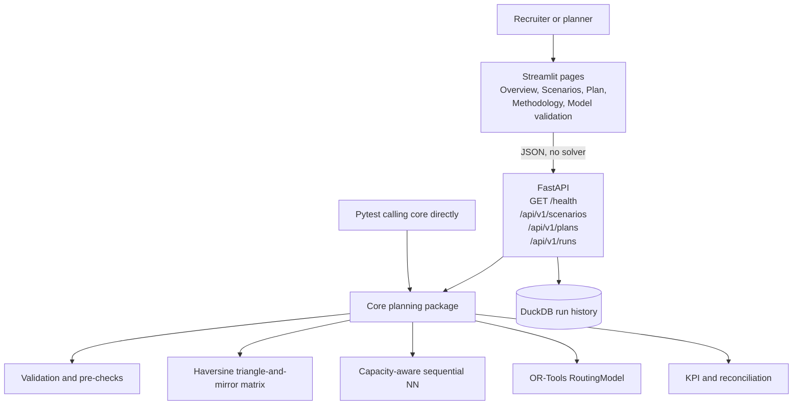

# Architecture

LastMile Lab is a static morning CVRP dispatch planner. The Streamlit UI never solves routes or recomputes KPIs. FastAPI never contains the solver body. Planning lives in `backend/app/core`, and both the API and the pytest suite call that package directly.

## Request flow

```text
Browser
   |
   v
Streamlit UI  (port 8501)
   |  HTTP JSON only
   v
FastAPI /api/v1  (port 8000)
   |
   +-- scenarios: load, validate, generate
   +-- plans: baseline, OR-Tools
   +-- runs: retrieve, constraint checks, JSON/CSV export
   |
   +--> core.validation / core.distance_matrix
   +--> core.baseline  (sequential nearest neighbour)
   +--> core.optimizer (OR-Tools RoutingModel)
   +--> core.kpis / core.invariants
   |
   v
DuckDBRepository  (data/runs/lastmile.duckdb)
```



The same core functions are imported by tests without starting Uvicorn or Streamlit.

## Layers

| Layer | Responsibility | Must not do |
|---|---|---|
| `frontend/` Streamlit | Scenario selection, maps, tables, captions | Recalculate distances, utilisation, or improvement % |
| `backend/app/api/` | HTTP mapping, CORS, error bodies, serializers | Own a second solver or a second KPI formula |
| `backend/app/core/` | Validation, matrix, NN, OR-Tools, KPIs, invariants | Depend on FastAPI or Streamlit |
| `backend/app/storage/` | `AppRepository` protocol; DuckDB implementation | Change API contracts when the store changes |

Phase 6 used an in-memory repository. Phase 8 swapped in DuckDB behind the same protocol. Run IDs, exports, and HTTP status mapping stayed the same.

## Frontend pages

| Page | Role |
|---|---|
| Overview | Last-mile story, VRP then CVRP, published Vienna 24 proof |
| Scenarios | Three curated presets or guided custom demand; one run-comparison action |
| Plan | Baseline and OR-Tools KPIs, both schematic maps, van tables, JSON/CSV export |
| Methodology | Short assumptions and solver notes (secondary) |
| Model validation | Reconstruct `x_ijk`, `y_ik`, and `u_k` from returned stops (secondary) |

`Home.py` registers those pages with `st.navigation`. LEARNING_6 remains a fixture and test suite; it is not in the primary UI. Session state keeps `scenario_id`, `baseline_run_id`, `optimised_run_id`, and `_plan_bundle`. Changing scenario drops stale run IDs so plans from different datasets cannot be compared.

OpenStreetMap tiles are schematic. Route lines are synthetic connections, not road geometry.

## Documented MILP versus OR-Tools

The three-index formulation in [`mathematical_formulation.md`](mathematical_formulation.md) is the model the author must be able to explain. Google OR-Tools `RoutingModel` is the MVP solver. It does **not** solve that MILP with a MIP engine.

| Symbol | Documented meaning | How the application obtains it |
|---|---|---|
| `y_ik` | Customer `i` assigned to van `k` | Customer appears on vehicle `k`'s returned route |
| `x_ijk` | Van `k` travels `i → j` | Consecutive stops, including depot legs |
| `u_k` | Van `k` is used | Returned route contains at least one customer |
| `w_ik` | MTZ load-order potential | Not taken from the solver. Displayed load is the cumulative tote sum along the route |

OR-Tools settings used by the optimiser:

- first solution: `PATH_CHEAPEST_ARC`
- local search: `GUIDED_LOCAL_SEARCH`
- time limit: 1, 5, or 10 seconds

Ordinary portfolio output is the best feasible plan found within that search limit. It is not labelled globally optimal. LEARNING_6 is the documented exception because its 31.000 km optimum is independently enumerated.

## Data and fixtures

Fixed CSV scenarios live under `data/fixtures/`. Generated scenarios and runs are stored in DuckDB. Compose keeps that file on a named volume; Render Free disk is ephemeral. Distances are integer metres. Displayed kilometres use three decimal places. There are no Mapbox tokens or other secrets.

## Runtime topology

Local PowerShell (two processes on one machine):

```text
127.0.0.1:8000   FastAPI / Uvicorn
127.0.0.1:8501   Streamlit  (BACKEND_URL=http://localhost:8000)
```

Docker Compose (optional local / self-hosted):

```text
browser        -->  published Streamlit (host FRONTEND_PORT, default 8501)
frontend:8501  -->  backend:8000  on the Compose network
backend        -->  DuckDB at /app/data/runs/lastmile.duckdb (volume duckdb_data)
```

Free recruiter demo (no Compose):

```text
browser  -->  Streamlit Community Cloud
Streamlit (httpx)  -->  Render FastAPI (HTTPS, $PORT)
backend  -->  ephemeral DuckDB on the instance disk
```

Streamlit calls the API server-side, so CORS is unused for the UI. Deployment notes are in [`deployment.md`](deployment.md).
